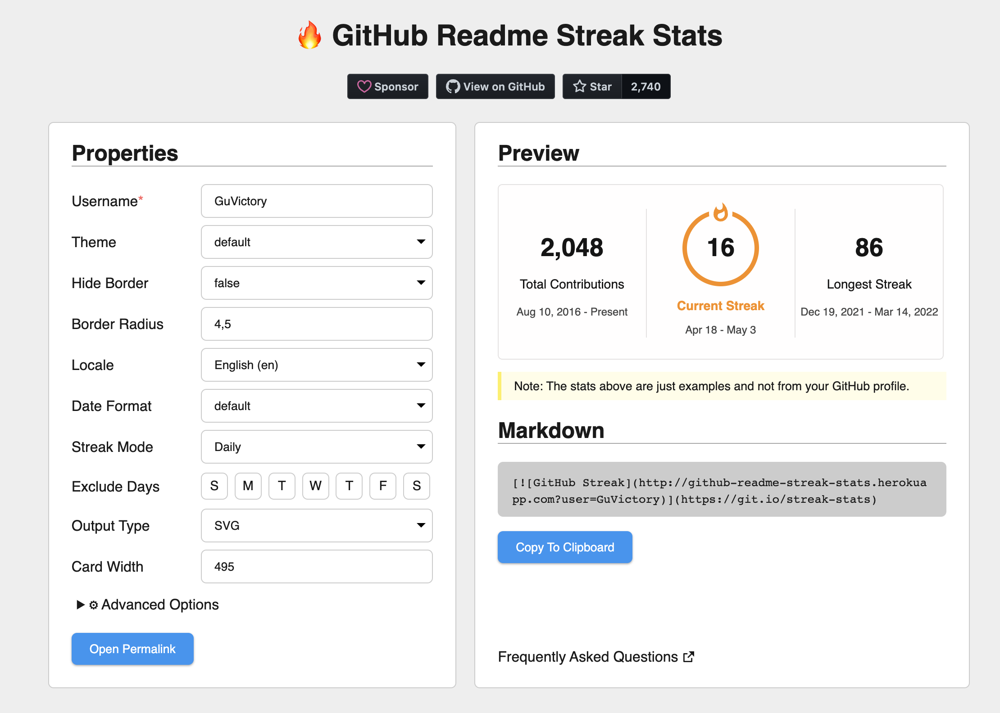

---
Категория:
  - HR-материал
Теги:
  - Резюме
---
- что такое файл `README.md` и как им пользоваться;
- добавим информацию о себе и своих навыках;
- добавим GitHub-статистику;

  

Чтобы всё получилось, вам нужны базовые знания `HTML` и `Markdown`.

  

### **Что такое файл README.md в профиле на GitHub и для чего он нужен**

Файл `README.md` в профиле на GitHub позволяет пользователям использовать Markdown-разметку, чтобы отображать детали о себе, о своём опыте, увлечениях, показывать GitHub-статистику и предоставлять эту информацию сообществу. Эти данные отображаются в верхней части вашей GitHub страницы над закрепленными репозиториями.

Так будем выглядеть профиль на GitHub по окончании этой статьи:


### **Создание README.md на GitHub**

Файл `README.md` находится в репозитории на GitHub, название которого совпадает с именем пользователя в вашей учетной записи. Чтобы создать репозиторий:

1. Войдите на [GitHub](https://github.com/)
2. Нажмите `+` в правом верхнем углу и выберите `New Repository`


3. Откроется страница создания нового репозитория. В названии укажите имя пользователя из вашего профиля. После того как вы введете имя пользователя, будет показана информация о том, что вы создаете особый репозиторий.


4. Под описанием репозитория не забудьте установить отметку `Public`, чтобы файл `README.md` был виден всем.
5. Обязательно установите отметку `Add a README file`. Это создаст файл `README.md`, в котором мы и будем работать. Сравните со скриншотом, у вас должно получиться также.


6. Далее нажимаем кнопку `Create repository`. Репозиторий успешно создан. Зайдите в только что созданный репозиторий и увидите, что в нем уже есть файл `README.md`.

В следующих разделах мы добавим информацию в наш файл `README.md`. Мы будет работать с файлом через интерфейс GitHub, но вы можете использовать любой другой текстовый редактор.

### **Добавление GIF-изображений и значков**

Есть множество бесплатных [ресурсов](https://giphy.com/stickers/hacktiv8-coding-codingfromhome-fromhome-M9gbBd9nbDrOTu1Mqx?utm_source=media-link&utm_medium=landing&utm_campaign=Media+Links&utm_term=), на которых вы можете взять GIF-изображения, например, для этой статьи я использовала [Giphy](https://giphy.com/).

Идем на страницу [GIF изображения](https://giphy.com/stickers/hacktiv8-coding-codingfromhome-fromhome-M9gbBd9nbDrOTu1Mqx?utm_source=media-link&utm_medium=landing&utm_campaign=Media+Links&utm_term=), нажимаем кнопку `Share`, а затем `Copy GIF Link`. Мы добавим эту скопированную ссылку в HTML-тег ``, чтобы отобразить ее в файле Markdown. Мы используем тег `` для упрощения настройки ширины изображения.

Замените содержимое файла `README.md` следующим кодом:

```HTML
<div id="header" align="center">
  
</div>
```

В атрибуте `src` указываем ссылку, которую мы ранее скопировали. Поскольку весь контент в этой части будет выровнен по центру, мы поместили изображение в HTML-тег `<div>` с атрибутом `align="center"`.

> [!important]  
> GitHub преобразует элементы Markdown в файле README.md в HTML. После этого HTML очищается и из соображений безопасности некоторые HTML-теги игнорируются, например \<script\>, \<style\> и т. д. По этим причинам мы использовали атрибут align вместо CSS-стилей.

Перейдем в окно предпросмотра. Наша картинка появилась на странице:


Далее мы добавим значки для ссылок на социальные сети, при клике на которые будет открываться нужный сайт. Вы можете добавить значки для самых разных сайтов: Instagram, Facebook, Twitter и т. д. Мы добавим три значка: Twitter, YouTube и LinkedIn.

Для создания и редактирования необходимых нам значков будем использовать ресурс [Shields.io](https://img.shields.io/). Используем URL-адрес [https://img.shields.io/badge/](https://img.shields.io/badge/) и передадим ему дополнительные параметры, чтобы получить нужные значки.

Первый параметр, который мы передадим, будет следующего формата: `**Label-Color**`

**Здесь:**

`Label` – название социальной сети, отображенное на значке.

`Color` – цвет самого значка.

Для трех социальных сетей значения будут следующие:

- LinkedIn: `LinkedIn-blue`
- Twitter: `Twitter-blue`
- YouTube: `YouTube-red`

Так должен выглядеть итоговый URL для LinkedIn:

```HTML
https://img.shields.io/badge/LinkedIn-blue
```

Обратите внимание, что пока на значке у нас только текст. Чтобы добавить логотип, нам нужно добавить в адрес еще 2 параметра:

- `logo` = {название иконки для социальной сети}
- `logoColor` = {цвет этой иконки}

Такой URL должен у нас получиться:

```HTML
https://img.shields.io/badge/LinkedIn-blue?logo=linkedin&logoColor=white
```

Также добавим параметр стиля к нашему URL-адресу. Существует множество вариантов стилей, подробнее можно ознакомиться на сайте [Shields.io](https://img.shields.io/). Мы будем использовать элемент `for-the-badge`.

Итоговый URL для значка LinkedIn будет выглядеть так:

```HTML
https://img.shields.io/badge/LinkedIn-blue?logo=linkedin&logoColor=white&style=for-the-badge
```

По аналогии создадим URL-адреса для остальных значков:

```HTML
https://img.shields.io/badge/YouTube-red?style=for-the-badge&logo=youtube&logoColor=white
https://img.shields.io/badge/Twitter-blue?style=for-the-badge&logo=twitter&logoColor=white
```

Добавим каждый URL в тег ``:

```HTML
<div id="badges" align="center">
  
  
  
</div>
```

Мы поместили изображения внутрь тега `<div>`, чтобы все значки были расположены на одной строке. Код выше выведет только картинки из URL-адресов. Чтобы добавить ссылки на социальный сети, каждое изображение нужно поместить в тег `<a>`.

Добавьте код ниже внутрь тега `<div> с id="badges"` и тег `` с нашим GIF-изображением. Также не забудьте добавить ссылки на свои социальные сети в атрибут `href`.

```HTML
<div id="badges">
  <a href="your-linkedin-URL">
    
  </a>
  <a href="your-youtube-URL">
    
  </a>
  <a href="your-twitter-URL">
    
  </a>
</div>
```

Вот что должно получиться:


Далее в этом же разделе мы добавим счетчик просмотров профиля. Он будет подсчитывать количество просмотров вашей страницы на GitHub. Для значка счетчика воспользуемся проектом с открытым исходным кодом. Документация по этому проекту находится в профиле [Views Counter](https://github.com/antonkomarev/github-profile-views-counter) на GitHub. Механизм очень похож на добавление значков для социальных сетей. Используем параметры стилей и в итоге должен получиться следующий URL:

```HTML
https://komarev.com/ghpvc/?username=имя пользователя на GitHub
```

Добавьте следующий код после тега `<div>` с `id="badges"`. Не забудьте указать верное имя пользователя.

```HTML

```

И в конце этого раздела добавим текст и эмодзи. GIF-изображение можно взять с сайта [Giphy](https://giphy.com/stickers/transparent-hvRJCLFzcasrR4ia7z?utm_source=media-link&utm_medium=landing&utm_campaign=Media+Links&utm_term=).

Добавьте этот код после тега `` в котором мы написали счетчик просмотров профиля:

```HTML
<h1>
  hey there
  
</h1>
```

Должно получиться что-то похожее:


Нажимаем кнопку `Commit changes` и тем самым сохраняем изменения. Итак, мы завершили первую часть по созданию файла `README.md` в нашем профиле на GitHub.

### **Добавление раздела «О себе»**

Добавим контент в раздел «О себе». Для оформления текста воспользуемся синтаксисом Markdown, так как нам не нужны никакие выравнивания. Добавьте этот код в ваш файл `README.md`:

```Markdown
### :woman_technologist: About Me :
```

Три дефиса `---` используются для добавления горизонтальной линии перед каждым разделом. Перед и после горизонтальной линии в Markdown должны быть пустые строки.

`:woman_technologist:` используется для добавления эмодзи. Также есть мужская версия этого эмодзи `:man_technologist:`

Список эмодзи и их кодов вы можете найти в репозитории по [ссылке](https://github.com/ikatyang/emoji-cheat-sheet/blob/master/README.md).

Далее мы кратко представимся. Нам будет достаточно одной строки и в этой же строке добавляем эмодзи. Вставьте следующий код в наш файл:

```Markdown
I am a Web Developer  from Russia.
```

Далее напишем список фактов о себе. Для этого используем синтаксис Markdown. В начале каждой строки добавим эмодзи. Добавьте следующий код и внесите соответствующие изменения. И не забудьте изменить `your-tg-url` и `your-username` на правильные.

```Markdown
- :telescope: I’m working as a Software Engineer and contributing to frontend and backend for building web applications.

- :seedling: Exploring Technical Content Writing.

- :zap: In my free time, I solve problems on Leetcode and read tech articles.

- :mailbox:How to reach me: [](your-tg-url)
```

Обратите внимание на последнюю строку. Внутри мы использовали элементы синтаксиса Markdown `` чтобы отобразить значок Telegram.

Вот что у нас получилось:


### **Добавление языков программирования и инструментов**

Для начала добавим заголовок, вставьте следующий код в файл `README.md`:

```Markdown
---

### :hammer_and_wrench: Languages and Tools :
```

Мы добавим изображения, которые отражают какими технологиями и навыками вы обладаете. Бесплатные логотипы для разных языков программирования можно найти тут [https://img.shields.io/badge](https://img.shields.io/badge).

Добавьте следующий код в файл. Откорректируйте список навыков, чтобы он соответствовал вашему опыту.

```Markdown


```

Вот результат того, что у нас получилось:


### **Добавление статистики GitHub**

Для заголовка добавьте следующий код в `README.md`:

```Markdown
---

### :fire: My Stats :
```

Мы добавим в этот раздел немного статистики по вашей активности на GitHub, например: количество коммитов, количество пулл-реквестов (`pull requests`) и т. д. На GitHub есть много проектов с открытым кодом, которые предоставляют различные данные по статистике. В этой статье мы будем использовать два проекта.

Первый проект – это [GitHub Streak Stats](https://github.com/DenverCoder1/github-readme-streak-stats). Он предоставляет следующие три показателя:

1. Общее число контрибуций пользователя.
2. Самый продолжительный период контрибуций.
3. Статистика по текущему периоду.

Получим доступ к статистике по следующему URL:

```Markdown
https://github-readme-streak-stats.herokuapp.com/?user=your-github-username
```

Мы можем немного кастомизировать вывод статистики (изменить тему, цвет фона и т. д.) добавлением параметров к URL. Добавьте следующий код в `README.md`. Замените `your-github-username` на своё имя пользователя.

```Markdown
[](https://git.io/streak-stats)
```

Вот что у нас должно получиться:


Также мы можем использовать ресурс [Streak Stats Website](http://github-readme-streak-stats.herokuapp.com/demo/) для генерации URL:

1. Зайдите на сайт [Streak Stats Website](http://github-readme-streak-stats.herokuapp.com/demo/). В поле `Username` введите имя пользователя на GitHub и заполните остальные поля.
2. Далее нажмите `Submit`.

3. После того как Markdown сгенерировался, нажмите `Copy To Clipboard` и добавьте скопированную информацию в `README.md`.



Следующий проект, который мы будет использовать для статистики – это [GitHub Readme Stats](https://github.com/anuraghazra/github-readme-stats), разработанный Anurag Hazra. Данный продукт предоставляет всевозможную статистику, но в этой статье мы будем использовать только одну. Она отображает ТОП языков программирования, которыми вы пользуетесь. Если вы хотите более подробно ознакомиться с этим проектом, можете почитать документацию в репозитории.

Ниже пример Markdown для отображения языков программирования, которые вы используете:

```Markdown
[](https://github.com/anuraghazra/github-readme-stats)
```

Здесь также можно доработать внешний вид (изменить цвет, ограничить количество языков и т. д.). Более подробно с возможностями кастомизации можно ознакомиться [здесь](https://github.com/anuraghazra/github-readme-stats).

Добавьте следующий код в `README.md`. Замените `your-github-username` своими данными.

```Markdown
[](https://github.com/anuraghazra/github-readme-stats)
```

Ниже пример того, что получилось:


### Советы по оформлению репозиториев

- Если у вас [README.md](http://README.md) проекта на английском, то и [README.md](http://README.md) репозиториев тоже должны быть на английском (если на русском, то логика действует такая же)
- Не забывайте в начале [README.md](http://README.md) добавлять описание проекта
- Далее инструкцию по установке зависимостей и запуску проекта
- Так же будет здорово, если вы приложите скриншоты работы программы

### П**римеры хорошо оформленных профилей на github:**

- [https://github.com/GusevADresume](https://github.com/GusevADresume)
- [https://github.com/SerhioGonsales](https://github.com/SerhioGonsales?tab=overview&from=2024-06-01&to=2024-06-27)
- [https://github.com/Ruzhaya/](https://github.com/Ruzhaya/Ruzhaya/blob/main/README.md?plain=1)

### Полезное

- **[Описание разметки файла README](https://github.com/GnuriaN/format-README)**
- **[EMOJI CHEAT SHEET](https://github.com/GnuriaN/format-README/blob/master/emoji.md)**